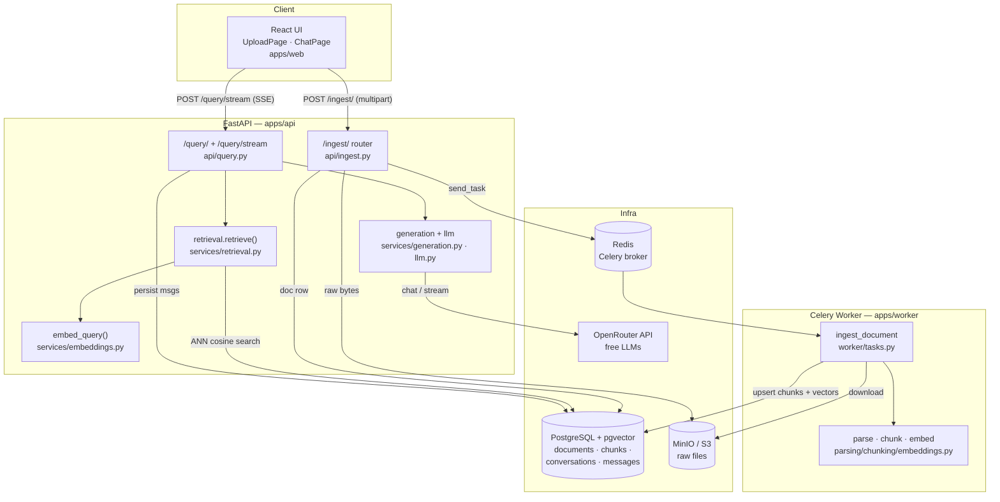
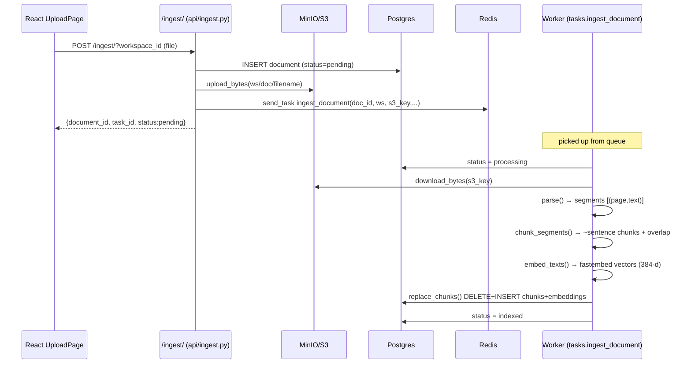
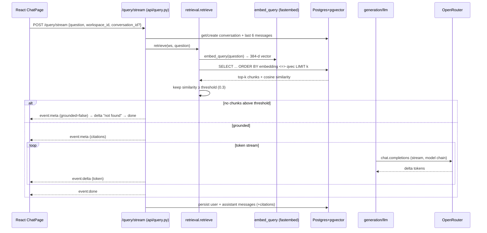
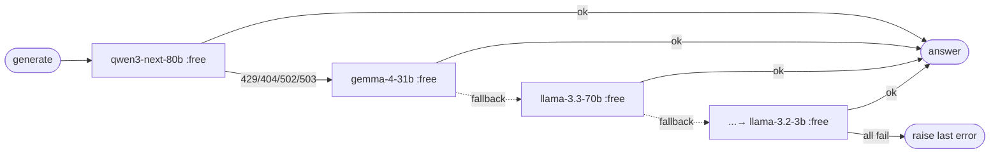

# DocSense — Project Overview

> AI document intelligence. RAG pipeline → grounded, cited answers from your own documents.
> This doc describes the **implemented system** (branch `feat/m1-rag-free-path`), not just the plan.
> For design intent / roadmap see [`IMPLEMENTATION_PLAN.md`](IMPLEMENTATION_PLAN.md) and [`DocSense_PRD.md`](DocSense_PRD.md).

---

## 1. What It Does

Upload documents (txt / md / PDF / DOCX) → DocSense parses, chunks, embeds, and stores them as
vectors. Ask a question → it retrieves the most relevant chunks, and an LLM answers **only** from
those chunks with source + page citations. If nothing relevant is found, it says so instead of
guessing (**grounded-by-default**).

**Free path:** embeddings run locally (fastembed, offline, no key); generation uses OpenRouter
free-tier models with an automatic fallback chain.

---

## 2. Tech Stack

| Layer | Tech |
|---|---|
| **API** | Python · FastAPI · SQLAlchemy (async) · SSE (`sse-starlette`) · structlog |
| **Worker** | Celery · psycopg2 (sync) |
| **Frontend** | React · Vite · TypeScript · Tailwind |
| **Database** | PostgreSQL + `pgvector` (HNSW, cosine) |
| **Broker / queue** | Redis (Celery broker + result backend) |
| **Object storage** | MinIO / S3 (raw uploaded files) |
| **Embeddings** | `fastembed` local `BAAI/bge-small-en-v1.5` (dim 384), or OpenAI (swappable) |
| **Generation** | OpenRouter (OpenAI-compatible client), free models + fallback chain |
| **Parsing** | `pypdf` (PDF), `python-docx` (DOCX), native (txt/md) |
| **Infra** | Docker Compose · Alembic migrations · GitHub Actions CI |

Monorepo: `apps/api`, `apps/worker`, `apps/web`, `packages/shared-py`, `packages/shared-ts`.

---

## 3. System Architecture



Key design choice: **the API never imports the worker package**. It dispatches by task name
(`worker.tasks.ingest_document`) through Redis (`services/queue.py`). Embedding code is duplicated
in both packages on purpose so they stay decoupled — the two copies must use the **same dim**.

---

## 4. Data Flow Diagram — Ingestion

Upload is **async**: the HTTP request returns immediately (`status: pending`) with a `task_id`;
the heavy work happens in the Celery worker.



**Pipeline stages** (`worker/tasks.py:ingest_document`):

| # | Stage | File · function | Notes |
|---|---|---|---|
| 1 | Fetch | `storage.download_bytes` | pull raw file from S3 |
| 2 | Parse | `parsing.parse` | txt/md → 1 segment; PDF → per-page; DOCX → joined paragraphs. Images raise `UnsupportedFileType` (M2) |
| 3 | Chunk | `chunking.chunk_segments` | sentence-aware pack to `chunk_target_tokens` + overlap tail; global `chunk_index` |
| 4 | Embed | `embeddings.embed_texts` | local fastembed batch (or OpenAI) |
| 5 | Upsert | `db.replace_chunks` | delete old chunks for doc, bulk-insert new (idempotent re-ingest) |

**Document status state machine:** `pending → processing → indexed | failed | unsupported`.
On exception the task retries (`max_retries=3`, 30s delay) and marks `failed`.

---

## 5. Data Flow Diagram — Query (RAG)

Retrieval **gates** generation. No chunk above the confidence threshold → canned "not found", LLM
never called.



**Two endpoints** (`api/query.py`):
- `POST /query/` — non-streaming, returns full `{answer, citations, grounded, conversation_id}`.
- `POST /query/stream` — SSE: `meta` (conversation + citations) → `delta`* (tokens) → `done`.
  Frontend parses this in `apiClient.streamQuery` (`apps/web/src/lib/apiClient.ts`).

**Grounding enforcement** is layered:
1. **Retrieval gate** — `retrieval.py` drops chunks below `retrieval_confidence_threshold` (0.3 cosine).
2. **Prompt** — `generation.SYSTEM` forbids outside knowledge; instructs exact "not found" string.
3. **Post-check** — non-stream path: if LLM output contains the NOT_FOUND sentinel → `grounded=false`, citations cleared.

**Context** — last `HISTORY_LIMIT = 6` messages of the conversation are replayed as chat history (multi-turn).

---

## 6. LLM Generation — Fallback Chain

OpenRouter `:free` models are often rate-limited (429) or unavailable (404). `services/llm.py`
tries each model in order, advancing on `{404, 429, 502, 503}`.



- Chain = `generation_model` prepended to `generation_models` (CSV), de-duplicated (`models_chain()`).
- Client built with `max_retries=0` so the SDK doesn't stall ~50s on a 429 before we switch models.
- **Streaming caveat:** fallback only applies **before the first token**. Once a stream starts, an error ends it (can't restart mid-answer).
- If generation fails entirely, query path degrades gracefully: returns retrieved context with a "Set a valid OPENROUTER_API_KEY" notice rather than erroring.

---

## 7. Data Model (PostgreSQL + pgvector)

Migrations: `0001_initial.py` (base schema, embedding `Vector(1536)` for OpenAI) →
`0002_embedding_dim_384.py` (resizes `chunks.embedding` to **384** for local fastembed
`bge-small-en-v1.5`; drops + rebuilds the HNSW index since it's bound to the column dim).

| Table | Key columns | Purpose |
|---|---|---|
| `workspaces` | id, name, settings(json) | tenant root |
| `documents` | id, workspace_id, filename, mime_type, **status**, source, owner_id, created_at | ingestion state machine |
| `chunks` | id, document_id, workspace_id, text, page, chunk_metadata(json), embedding_model, **embedding `vector(384)`** | retrieval unit; HNSW cosine index + `workspace_id` index |
| `conversations` | id, workspace_id, user_id, summary, created_at | chat thread |
| `messages` | id, conversation_id, role, content, citations(json), tokens_used, cost_usd, created_at | history + audit |

Indexes: `ix_chunks_workspace_id`; `ix_chunks_embedding_hnsw` (HNSW, `vector_cosine_ops`).
Tenant isolation: every retrieval query filters `c.workspace_id`.

> Note: embedding dim is migration-driven (384), not read from `settings.embedding_dim`. Switching
> to a different-dim embedding model (e.g. OpenAI 1536) needs a new migration + full re-embed.

---

## 8. API Surface

| Method | Path | Handler | What |
|---|---|---|---|
| `POST` | `/ingest/?workspace_id` | `ingest.upload_document` | multipart upload → store + enqueue; returns `task_id` |
| `GET` | `/ingest/documents?workspace_id` | `ingest.list_documents` | list docs + status |
| `POST` | `/query/` | `query.query_documents` | non-stream cited answer |
| `POST` | `/query/stream` | `query.query_stream` | SSE token stream |
| `*` | `/workspaces` | `api/workspaces.py` | workspace CRUD |
| `GET` | `/health` | `api/health.py` | liveness |

CORS allows `http://localhost:3000` (the Vite web app). Workspace defaults to `"default"`.

---

## 9. Frontend

`apps/web` — Vite + React + Tailwind.

- `src/pages/UploadPage.tsx` — drag-drop upload, polls document status.
- `src/pages/ChatPage.tsx` — chat with streaming answers + sources.
- `src/lib/apiClient.ts` — calls API under `/api` proxy:
  - `uploadDocument` → multipart `POST /ingest/`
  - `streamQuery` → `fetch` reader parsing SSE blocks (`meta` / `delta` / `done`), returns an abort fn.
  - `query`, `listDocuments` for non-stream + listing.

---

## 10. Configuration (env)

`apps/api/app/config.py` (pydantic-settings, reads `.env`). Key vars:

| Var | Default | Note |
|---|---|---|
| `DATABASE_URL` / `DATABASE_URL_SYNC` | postgres docsense | async (API) / sync (worker) |
| `REDIS_URL`, `CELERY_BROKER_URL`, `CELERY_RESULT_BACKEND` | redis | queue |
| `S3_ENDPOINT_URL`, `S3_BUCKET`, keys | minio | raw file storage |
| `EMBEDDING_PROVIDER` | `local` | `local` (fastembed) or `openai` |
| `EMBEDDING_MODEL` / `EMBEDDING_DIM` | `BAAI/bge-small-en-v1.5` / `384` | must match `chunks.embedding` column |
| `OPENROUTER_API_KEY` / `OPENROUTER_BASE_URL` | — | generation |
| `GENERATION_MODEL` / fallback chain | qwen3-next-80b :free | `models_chain()` |
| `RETRIEVAL_TOP_K` / `RETRIEVAL_CONFIDENCE_THRESHOLD` | `5` / `0.3` | retrieval gate |

> 🔐 **Security:** the committed `.env` contains a **real `OPENROUTER_API_KEY`**. Rotate it and keep
> `.env` out of version control (`.env.example` only). `JWT_SECRET=change-me-in-production` is also a placeholder.

---

## 11. Deployment / Local Stack

`docker-compose.yml` services: `postgres` (pgvector), `redis`, `minio`, `api`, `worker`, `web`, one-shot `migrate`.

```bash
cp .env.example .env   # fill keys
make up                # start stack
make migrate           # alembic
# API :8000 · Web :3000 · MinIO :9001
```

> Upload testing: use **PowerShell** (`Invoke-WebRequest`), not Git Bash `curl` (returns HTTP 000 on this setup).

---

## 12. Status & Roadmap

| Phase | Scope | State |
|---|---|---|
| **M0** | Scaffold, pgvector spike | done |
| **M1** | Core RAG: ingest (text/PDF/DOCX) → cited answer, SSE, React chat+upload | **current branch** |
| **M2** | Multimodal (vision parse of images/scans), JSON extraction, confidence review | planned (`parsing.py` stubs `UnsupportedFileType`) |
| **M3** | Router + LangGraph agent (tool-calling, 5-step cap), reasoning model, context summarization | planned |

**Not yet implemented (planned in `IMPLEMENTATION_PLAN.md`):** JWT auth/RBAC middleware, LangGraph
agent + router, vision parsing, usage/cost dashboard, eval pipeline, `ingestion_jobs`/`usage_events`/`audit_log` tables.
